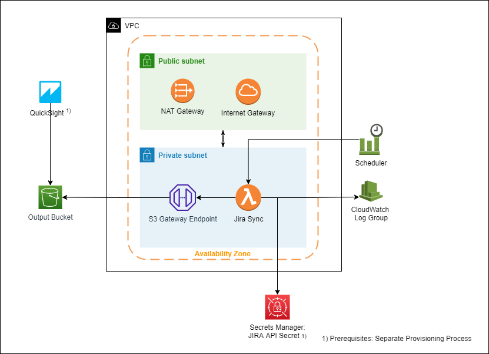
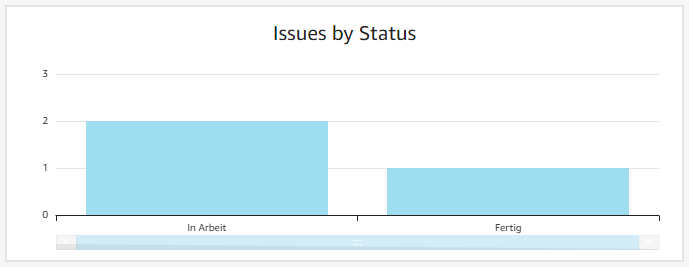

# Custom JIRA-Sync for QuickSight <!-- omit in toc -->

1. [Summary](#summary)
2. [Architecture](#architecture)
3. [Getting Started](#getting-started)
   1. [Pre-requisites](#pre-requisites)
   2. [Configuration](#configuration)
   3. [Rollout & Test](#rollout--test)
   4. [Create QuickSight Dashboard](#create-quicksight-dashboard)
4. [Ideas for Improvement](#ideas-for-improvement)

# Summary
QuickSight offers an option to connect to JIRA API directly, but unfortunately this feature has some limitations. As an example custom fields are omitted from the imported data and you are not able to specify a query to use. Therefore, a custom JIRA Sync using JIRA's REST API has been implemented.
The following challenges have been solved:
* Connect to JIRA from a private Lambda function using VPC networking with NAT Gateway
* Query JIRA API and write the results to an S3 Bucket that can be used as datasource for QuickSight
* Schedule JIRA sync. automatically every day at 06:00 am
* Use AWS SAM to easily rollout infrastructure and deploy application

 This project is an experimental prototype - do not use in production without adjustment. 

# Architecture

# Getting Started

## Pre-requisites
1. Install and configure AWS SAM - [Installation Instructions](https://docs.aws.amazon.com/toolkit-for-vscode/latest/userguide/setup-toolkit.html#setup-prereq)
2. Create an Atlassian API Token - [Instructions](https://support.atlassian.com/atlassian-account/docs/manage-api-tokens-for-your-atlassian-account/)
3. Create a secret in AWS Secrets Manager of type key-value pair with two entries: "user" and "api_token"
4. If you want to use the data from QuickSight, make sure to set up a QuickSight account

## Configuration
Open samconfig.toml and fill out the missing values:
- ApiTokenSecretName: The name of the secret in AWS Secrets Manager
- ApiTokenSecretArn: The arn of the created secret - required for IAM permission handling
- JqlQuery: The JIRA query to search for issues (you can test the query in JIRA and copy it here)
- JiraDomain: In format domain.atlassian.net

## Rollout & Test
1. Build your code using `sam build --use-container`
2. Deploy infrastructure and application using `sam deploy --capabilities CAPABILITY_NAMED_IAM`
3. If you do not want to wait for the scheduler to run, you can test the Lambda function manually via AWS Console
4. If you are done testing, you can delete everything by running `sam delete --stack-name jira-sync`
   1. Make sure to empty the Output Bucket first, otherwise the delete will fail

## Create QuickSight Dashboard
1. Use S3 as datasource (you can manage permissions to the output bucket in the settings of QuickSight)
2. Create a fancy dashboard using the provided views: 

# Ideas for Improvement
* Use multiple AZs for high availability
* Improve error handling of the lambda function
* Introduce monitoring and alerting in case something went wrong
* Do not overwrite the output file during each sync.
* Add tests and local configuration